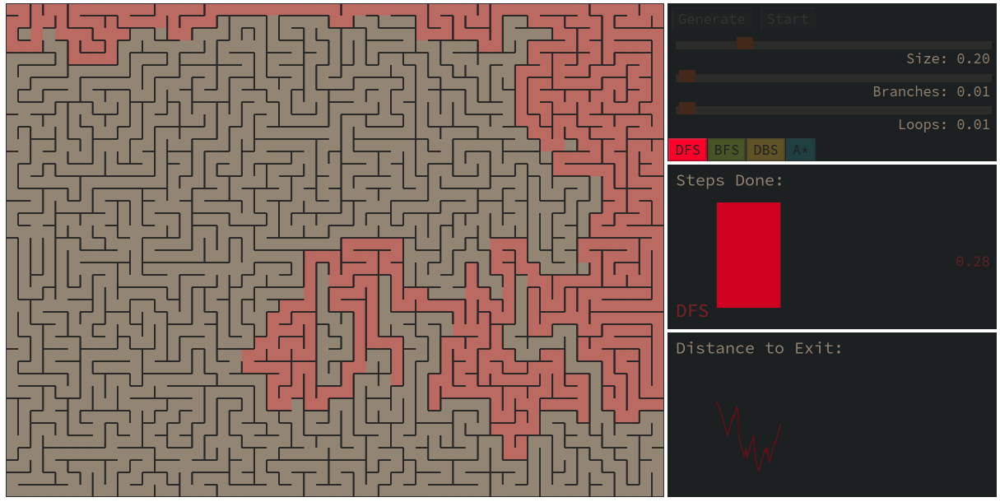

# Maze Solver
Comprehensive visualization of several path-finding algorithms.


## Quick Start
Check it online:
https://alexeykarnachev.github.io/maze_solver/

Or run it locally with any kind of http server, e.g:
```bash
python3 -m http.server --bind localhost
```
